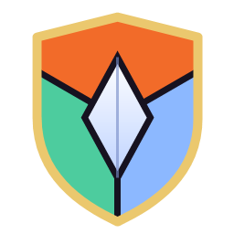

<div align="center">



# Velkaris: La Guerra de los Tres Reinos

**MMORPG 3D de Reino contra Reino (RvR) para PC, con asedio de fortalezas y servidor autoritativo.**


</div>

Tres reinos (la **Hegemonía de Brasalta**, el **Concilio de Umbravel** y los **Clanes de Céfira**)
luchan por la Frontera Rota, la meseta donde cayó la luna rota de Velkaris. Captura atalayas,
derriba los portones del **Bastión de Ilun** y lleva a tu reino a la victoria.

> Este repositorio es un **MVP jugable**: mundo hecho con primitivas 3D (sin arte final), combate y
> asedio completos, y una arquitectura de red pensada desde el principio contra trampas.

---

## Índice
- [Características](#características)
- [Requisitos](#requisitos)
- [Instalación rápida para jugadores](#instalación-rápida-para-jugadores-sin-compilar)
- [1. Clonar o descargar el proyecto](#1-clonar-o-descargar-el-proyecto)
- [2. Instalar Godot y las plantillas de exportación](#2-instalar-godot-y-las-plantillas-de-exportación)
- [3. Compilar el .exe y crear el acceso directo](#3-compilar-el-exe-y-crear-el-acceso-directo)
- [4. Hospedar una partida](#4-hospedar-una-partida)
- [5. Conectar a tus amigos (IP y puertos)](#5-conectar-a-tus-amigos-ip-y-puertos)
- [6. Configuración del servidor](#6-configuración-del-servidor)
- [7. Controles](#7-controles)
- [8. Solución de problemas](#8-solución-de-problemas)
- [9. Estructura del proyecto](#9-estructura-del-proyecto)
- [10. Arquitectura y seguridad](#10-arquitectura-y-seguridad)
- [Hoja de ruta](#hoja-de-ruta)

---

## Características

- **3 reinos y 3 clases originales** (Quebrantamuros, Cantor de Esquirlas y Zapador de Bruma) con 9 habilidades. Lore en [`docs/LORE.md`](docs/LORE.md).
- **Asedio RvR:** 3 atalayas capturables, fortaleza central con 3 portones destructibles, santuarios protegidos y una campaña a 300 puntos.
- **Servidor autoritativo a 30 Hz:** el cliente solo envía intenciones; posiciones, daño y enfriamientos los decide el servidor.
- **Netcode fluido:** predicción local con reconciliación e interpolación de los demás jugadores.
- **Seguridad:** anti-speedhack, anti-teleport, validación de paquetes, rate limiting, contraseña con desafío-respuesta, bloqueo de IP por fuerza bruta y área de interés contra wallhacks.
- **Optimizado para gama baja** (8 GB de RAM y GPU de 2 GB): renderer *Compatibility* (OpenGL 3.3), cero texturas y `MultiMesh`.
- **Multijugador fácil:** botón *Hospedar y jugar*, o servidor dedicado para Windows y Linux.

## Requisitos

| | Mínimo |
|---|---|
| **Para jugar** | Windows 10/11 de 64 bits, 8 GB de RAM, GPU de 2 GB compatible con OpenGL 3.3, ~200 MB de disco |
| **Para compilar** | Lo anterior + [Godot 4.3 o superior](https://godotengine.org/download/windows/) (versión **estándar**, no la .NET) y sus plantillas de exportación. [Git](https://git-scm.com/download/win) es opcional. |
| **Red** | Puerto **UDP 7777** (configurable) accesible para quien hospeda |

---

## Instalación rápida para jugadores (sin compilar)

1. Entra en **[Releases](https://github.com/LucianoColalunga/Velkaris/releases)** y descarga `Velkaris-Windows-x64.zip`.
2. Descomprímelo en una carpeta, por ejemplo `C:\Juegos\Velkaris`.
3. Haz doble clic en **`Crear_acceso_directo.bat`**: aparecerá el icono **Velkaris** en tu Escritorio.
4. Abre el juego y sigue la sección [5. Conectar a tus amigos](#5-conectar-a-tus-amigos-ip-y-puertos).

> **Windows SmartScreen** puede avisar porque el ejecutable no está firmado digitalmente.
> Pulsa **"Más información" → "Ejecutar de todas formas"**.

---

## 1. Clonar o descargar el proyecto

**Opción A: con Git** (recomendado; así actualizas con `git pull`):

```bash
git clone https://github.com/LucianoColalunga/Velkaris.git
```

```bash
cd Velkaris
```

**Opción B: sin Git.** En la página del repositorio pulsa **Code → Download ZIP** y descomprímelo.

## 2. Instalar Godot y las plantillas de exportación

1. Descarga **Godot 4.3 o superior, versión estándar** desde <https://godotengine.org/download/windows/>.
   Es un `.zip` portátil: descomprímelo, por ejemplo, en `C:\Godot\`. No requiere instalación.
2. Abre Godot, pulsa **Importar**, elige el archivo `project.godot` de esta carpeta y ábrelo.
3. Instala las plantillas de exportación (una sola vez por versión de Godot):
   **Editor → Gestionar plantillas de exportación… → Descargar e instalar**.
4. *(Opcional)* Pulsa **F5** para probar el juego desde el editor.

## 3. Compilar el .exe y crear el acceso directo

### Opción A: script automático (recomendado)

Haz doble clic en **`compilar.bat`**, en la raíz del proyecto. El script:

1. Busca Godot (en `PATH`, en la variable `GODOT`, en Descargas, Escritorio, Documentos o `C:\Godot`).
2. Comprueba que las plantillas de exportación estén instaladas.
3. Exporta el **cliente** y el **servidor dedicado**.
4. Crea en el Escritorio los accesos directos **Velkaris** y **Velkaris - Servidor**, con su icono.

Si Godot está en otra ruta, o quieres generar los `.zip` para publicar una Release, ejecuta el script
desde PowerShell:

```bash
powershell -ExecutionPolicy Bypass -File tools\build_windows.ps1 -GodotPath "C:\Godot\Godot_v4.3-stable_win64.exe" -Zip
```

Resultado:

| Archivo | Para qué sirve |
|---|---|
| `build\windows\Velkaris.exe` | El juego (cliente). Es lo que usan tus amigos. |
| `build\server\iniciar_servidor.bat` | Arranca el servidor dedicado con ventana de logs. |
| `build\server\server.cfg` | Puerto, contraseña, nombre y número máximo de jugadores. |
| `build\Velkaris-Windows-x64.zip` | Con `-Zip`: paquete listo para subir a GitHub Releases. |
| `build\linux-server\velkaris_server.x86_64` | Con `-Linux`: servidor para un VPS Linux. |

### Opción B: manual desde el editor de Godot

1. **Proyecto → Exportar…** → selecciona **Windows Desktop** → **Exportar proyecto…**
2. Desmarca *Exportar con depuración* y guarda como `build\windows\Velkaris.exe`.
3. Repite con el preset **Windows Server** → `build\server\VelkarisServer.exe`.
4. Crea el acceso directo: clic derecho sobre `Velkaris.exe` → **Mostrar más opciones → Enviar a →
   Escritorio (crear acceso directo)**. El icono ya va incrustado en el `.exe`.

### Opción C: compilación en la nube (GitHub Actions)

El repositorio incluye [`.github/workflows/build.yml`](.github/workflows/build.yml). Al publicar una
etiqueta de versión, GitHub compila y adjunta los `.zip` a una Release automáticamente:

```bash
git tag v0.1.0
```

```bash
git push origin v0.1.0
```

---

## 4. Hospedar una partida

Quien hospeda ejecuta el servidor; todos los demás (incluido el anfitrión) se conectan como clientes.

### A) "Hospedar y jugar" (lo más fácil)
Abre **Velkaris**, rellena tus datos y pulsa **Hospedar y jugar**. El juego arranca un servidor
local en segundo plano y te conecta a él. El servidor se cierra cuando sales.

### B) Servidor dedicado (recomendado para partidas largas)
1. Edita `build\server\server.cfg` (puerto, contraseña, nombre).
2. Abre **Velkaris - Servidor** (o `iniciar_servidor.bat`). Verás los logs en la consola.
3. Abre **Velkaris** y conéctate a `127.0.0.1`.

### C) VPS Linux (servidor 24/7)
Compila con `-Linux`, sube la carpeta `build\linux-server` al VPS y ejecuta:

```bash
chmod +x velkaris_server.x86_64 && ./velkaris_server.x86_64 --headless -- --server
```

En el VPS, abre el puerto **UDP 7777** en su firewall (`ufw allow 7777/udp`) y en el panel del proveedor.

---

## 5. Conectar a tus amigos (IP y puertos)

| Dato | Valor por defecto | Dónde se cambia |
|---|---|---|
| Protocolo | **UDP** (no TCP) | No se cambia |
| Puerto | **7777** | `server.cfg` (`port=`) o `--port=XXXX`; los jugadores lo escriben en el menú |
| Contraseña | vacía | `server.cfg` (`password=`) |

### 5.1 En la misma red (misma casa / misma Wi-Fi)
1. El anfitrión abre una consola (`Win + R` → `cmd`) y ejecuta `ipconfig`. Anota la **Dirección IPv4**,
   por ejemplo `192.168.1.35`.
2. El anfitrión permite el puerto en el Firewall de Windows (una sola vez). Clic derecho en
   `tools\abrir_puerto_firewall.ps1` (también está en `build\server\`) → **Ejecutar con PowerShell**
   y acepta el aviso de administrador.
   *Alternativa:* cuando Windows pregunte si permite el acceso a Velkaris, marca **Redes privadas**.
3. Los amigos escriben esa IP y el puerto en el menú y pulsan **Unirse al servidor**.

> La regla de firewall solo se aplica a redes **privadas**. Si tu red figura como "Pública", cámbiala en
> *Configuración → Red e Internet → Propiedades → Perfil de red: Privado*.

### 5.2 Por Internet, opción recomendada: VPN privada
Sin abrir puertos en el router y con el tráfico cifrado:

1. Todos instalan **[Tailscale](https://tailscale.com/download)** (o ZeroTier o Radmin VPN) y entran en la misma red.
2. El anfitrión copia su IP de Tailscale (empieza por `100.`).
3. Los amigos usan esa IP en el menú del juego.

Es la opción más segura: el servidor no queda expuesto a todo Internet. Puedes limitarlo aún más
poniendo esa IP en `bind_ip=` de `server.cfg`.

### 5.3 Por Internet: reenvío de puertos (port forwarding)
1. Entra al router (normalmente `http://192.168.1.1` o `http://192.168.0.1`).
2. Busca **Reenvío de puertos / Port Forwarding / Servidor virtual** y crea una regla:
   **UDP 7777 → IPv4 local del anfitrión** (la de `ipconfig`) → puerto 7777.
3. Averigua tu IP pública en <https://ifconfig.me> y pásasela a tus amigos.
4. **Pon una contraseña** en `server.cfg`, porque el servidor queda accesible desde Internet.

> Si tu proveedor usa **CGNAT** (la IP del router no coincide con la de ifconfig.me), el reenvío no
> funcionará: usa la opción 5.2.

### 5.4 Qué pone cada amigo en el menú

| Campo | Ejemplo |
|---|---|
| Nombre | `Kaelith` (3-16 letras, números o `_`, único en el servidor) |
| Reino / Clase | El que quiera (el servidor puede pedir equilibrar reinos) |
| Servidor | `192.168.1.35` (LAN), `100.101.102.103` (Tailscale) o la IP pública o dominio del anfitrión |
| Puerto (UDP) | `7777` |
| Contraseña | La que el anfitrión puso en `server.cfg` |

> Todos deben usar **la misma versión** del juego. Si no coincide, el servidor lo indica al conectar.

---

## 6. Configuración del servidor

`server.cfg` (se crea a partir de [`server.cfg.example`](server.cfg.example)):

| Clave | Por defecto | Descripción |
|---|---|---|
| `name` | `Servidor de Velkaris` | Nombre visible para los jugadores |
| `port` | `7777` | Puerto UDP |
| `max_players` | `32` | Jugadores simultáneos |
| `password` | `""` | Contraseña (nunca viaja por la red; se usa desafío-respuesta) |
| `bind_ip` | `*` | Interfaz donde escuchar (`*` = todas) |
| `realm_balance_margin` | `3` | Diferencia máxima de jugadores entre reinos (`0` = sin límite) |
| `max_conn_per_ip` | `4` | Conexiones simultáneas desde una misma IP |

Los argumentos de línea de comandos tienen prioridad sobre el archivo:

```bash
VelkarisServer.console.exe --headless -- --server --port=7777 --password=secreto --max-players=24 --name="Asedio del viernes"
```

---

## 7. Controles

| Acción | Tecla |
|---|---|
| Moverse | `W` `A` `S` `D` / flechas |
| Girar la cámara | Clic derecho o izquierdo + arrastrar, o `Q` / `E` |
| Zoom | Rueda del ratón |
| Habilidades | `1` `2` `3` |
| Siguiente objetivo (enemigos y portones) | `Tab` |
| Soltar objetivo / menú | `Esc` |
| Chat de reino | `Enter` |
| Ayuda | `F1` |

**Cómo se gana:** quédate dentro del círculo de una atalaya para capturarla, derriba un portón del
Bastión y captura su Esquirla central. Cada 5 s tu reino suma +1 por atalaya y +3 por el Bastión, y
+2 por cada derribo. Gana el primero en llegar a 300 puntos.

---

## 8. Solución de problemas

| Problema | Solución |
|---|---|
| *"No se pudo conectar…"* | Comprueba la IP y el puerto, que el servidor esté encendido y el firewall (5.1). Por Internet: reenvío **UDP** (no TCP) o usa Tailscale. |
| *"Versión incompatible"* | Anfitrión y amigos deben usar la misma Release o el mismo commit. |
| *"Contraseña incorrecta"* | Tras 5 intentos fallidos la IP se bloquea 5 minutos. |
| *"Ese reino tiene demasiados jugadores"* | Elige otro reino o pon `realm_balance_margin=0`. |
| `compilar.bat` no encuentra Godot | `tools\build_windows.ps1 -GodotPath "C:\ruta\Godot_v4.x-stable_win64.exe"` o crea la variable de entorno `GODOT`. |
| Faltan plantillas de exportación | En Godot: **Editor → Gestionar plantillas de exportación → Descargar e instalar**. |
| PowerShell no deja ejecutar scripts | Usa los `.bat` o `powershell -ExecutionPolicy Bypass -File …` (solo afecta a ese comando). |
| Pocos FPS | Desactiva *Sombras* en el menú, cierra el navegador y actualiza los drivers de la GPU. |
| El servidor dice que el puerto está en uso | Ya hay otro servidor abierto, o cambia `port=` en `server.cfg`. |
| Logs | `%APPDATA%\Godot\app_userdata\Velkaris\logs\godot.log` |

---

## 9. Estructura del proyecto

```
Velkaris/
├── project.godot              # Configuración de Godot (renderer Compatibility, 30 ticks/s)
├── export_presets.cfg         # Presets: Windows Desktop, Windows Server, Linux Server
├── icon.png / icon.ico        # Icono del proyecto y del .exe
├── server.cfg.example         # Plantilla de configuración del servidor
├── compilar.bat               # Compilación con doble clic
├── scenes/main.tscn           # Escena de entrada (el resto se construye por código)
├── scripts/
│   ├── main.gd                # Arranque: decide servidor (headless) o cliente (menú)
│   ├── net/network.gd         # Autoload "Net": la única superficie RPC
│   ├── shared/                # Código común cliente-servidor
│   │   ├── protocol.gd        #   constantes de red, saneamiento y validación
│   │   ├── game_data.gd       #   reinos, clases, habilidades y mapa
│   │   └── movement.gd        #   movimiento determinista + colisiones
│   ├── server/                # Solo se ejecuta en el servidor
│   │   ├── game_server.gd     #   autenticación, simulación, combate, asedio, anticheat
│   │   ├── rate_limiter.gd    #   token bucket
│   │   └── server_config.gd   #   server.cfg + argumentos
│   ├── client/                # Solo se ejecuta en el cliente
│   │   ├── game_client.gd     #   conexión, predicción, reconciliación, interpolación
│   │   ├── world_view.gd      #   mapa con primitivas y MultiMesh
│   │   ├── player_avatar.gd   #   personajes
│   │   ├── camera_rig.gd      #   cámara MMO
│   │   ├── hud.gd             #   interfaz en partida
│   │   └── input_setup.gd     #   teclas
│   └── ui/main_menu.gd        # Menú principal
├── tools/                     # Scripts de Windows (compilar, acceso directo, firewall, icono)
├── docs/                      # Lore, arquitectura y seguridad
└── .github/workflows/         # Compilación automática en GitHub Actions
```

## 10. Arquitectura y seguridad

Resumen (detalle completo en [`docs/ARQUITECTURA_Y_SEGURIDAD.md`](docs/ARQUITECTURA_Y_SEGURIDAD.md)):

- **Modelo autoritativo:** el cliente envía *direcciones* de movimiento y peticiones de habilidad;
  el servidor simula y responde con snapshots. Nunca se acepta una posición del cliente.
- **Anti-speedhack:** fichas de movimiento por tick del servidor; enviar más comandos no acelera.
- **Validación de paquetes:** tipo, rango, NaN/Inf y tamaño de todo lo que llega, con puntos de
  infracción y expulsión automática.
- **Anti-wallhack:** área de interés y filtrado del sigilo en el servidor.
- **Conexión:** desafío-respuesta con nonce, comparación en tiempo constante, bloqueo de IP,
  `server_relay` desactivado y decodificación de objetos desactivada.

### Prueba automática (smoke test)
[`tests/smoke_bot.gd`](tests/smoke_bot.gd) levanta un bot que se autentica con contraseña, camina
desde su santuario hasta el Portón Norte (la muralla debe frenarlo) y lo golpea. Con el servidor
corriendo en otra consola:

```bash
godot --headless --path . -- --server --port=7790 --password=prueba
```

```bash
godot --headless --path . res://tests/smoke_bot.tscn -- --port=7790 --password=prueba
```

Termina con `RESULTADO: OK` (código 0) si todo funciona.

## Hoja de ruta
- [ ] Cifrado DTLS del tráfico ENet
- [ ] Cuentas persistentes y base de datos de la campaña
- [ ] Reliquias (*Corazones de Esquirla*) y armas de asedio
- [ ] Modelos 3D, animaciones y sonido
- [ ] Más clases por reino y rangos de reino

## Licencia
Código bajo licencia [MIT](LICENSE) © 2026 Luciano Colalunga. Velkaris, sus reinos, clases y lore
son creaciones originales de este proyecto.
